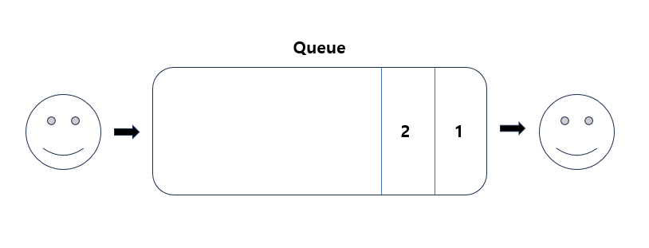
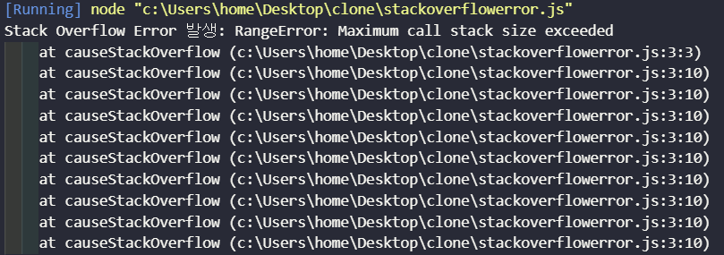

# 큐 (Queue)

- FIFO (First In First Out) 의 형태로 데이터를 저장하는 구조
- 즉 선입선출의 구조를 가지고 있다.

> 주요 동작

- enqueue - queue의 가장 맨 뒤에 요소를 추가한다.
- dequeue - queue의 맨 앞의 요소를 삭제한다.
- peek - 삭제하진 않지만 이제 곧 꺼내게 될 값을 확인한다.
- isEmpty - 큐가 비어 있는지 확인한다.
- size - 큐에 있는 요소의 개수를 반환한다.
- clear - 큐의 모든 요소를 제거한다.

> 큐의 사용 사례

- **producer / consumer architecture**

  

  ### 그렇다면 Queue는 항상 FIFO일까? </br> CPU 멀티태스킹의 Ready Queue로 뒤적거려보자.

  CPU가 싱글 코어로 여러 프로세스를 멀티태스킹하는 경우, 여러 프로세스가 CPU의 실행을 기다리며 대기 상태에 있을 때 이들을 관리하는 곳이 \***\*레디 큐(Ready Queue)\*\*** 라고 한다.

  레디 큐는 프로세스들이 CPU의 할당을 기다리며 대기하는 큐인데
  각 프로세스는 조금씩 CPU를 할당받아 실행되고 실행이 완료되지 않은 프로세스는 다시 레디 큐로 돌아가 대기한다. 이때 자연스럽게 "큐" 라는 용어 때문에 레디 큐가 항상 FIFO 방식으로 동작한다고 생각 할 수 있는데 반드시 그렇지는 않다고 한다.

  레디 큐의 동작 방식은 다양한 스케줄링 알고리즘에 따라 달라질 수 있으며, FIFO 방식이 아닌 우선순위 기반의 스케줄링 알고리즘을 사용하는 경우도 많다.

  예를 들어:

- **우선순위 스케줄링 (Priority Scheduling)**: 각 프로세스에 우선순위를 부여하고, 우선순위가 높은 프로세스가 먼저 CPU를 할당받는다. 이 경우, 레디 큐는 단순히 FIFO가 아닌 **우선순위 큐 (Priority Queue)**로 동작하게 된다. 우선순위가 높은 프로세스는 큐에 나중에 도착했더라도 먼저 실행된다.

- **라운드 로빈 (Round Robin)**: FIFO 기반이지만 각 프로세스가 시간 할당량을 가지고, 그 시간 동안만 CPU를 사용한 후 다시 큐의 끝으로 돌아간다. 이 경우에는 기본적으로 FIFO를 따르지만, 시간 할당량에 따라 프로세스가 계속해서 순환하며 CPU를 할당받게 된다.

  따라서, *"큐"*라는 용어가 사용되더라도, 큐의 동작 방식이 항상 FIFO라는 가정은 옳지 않다. CPU 스케줄링의 경우, 프로세스의 우선순위, 응답 시간 등을 고려해 다양한 방식으로 큐가 동작할 수 있기 때문이다.

> 백준 10845번 문제로 큐의 동작을 직접 구현해보자.

```js
let commands = input.slice(1);

let queue = [];
let result = [];

commands.forEach((command) => {
  let [cmd, value] = command.split(" ");
  switch (cmd) {
    case "push":
      queue.push(parseInt(value));
      break;
    case "pop":
      result.push(queue.length ? queue.shift() : -1);
      break;
    case "front":
      result.push(queue.length ? queue[0] : -1);
      break;
    case "back":
      result.push(queue.length ? queue[queue.length - 1] : -1);
      break;
    case "size":
      result.push(queue.length);
      break;
    case "empty":
      result.push(queue.length ? 0 : 1);
      break;
  }
});

console.log(result.join("\n"));
```

> 자주 발생하는 에러도 분석해보자.



```js
function causeStackOverflow() {
  // 재귀 호출을 무한히 반복하여 스택 오버플로우 유발
  return causeStackOverflow();
}

try {
  causeStackOverflow();
} catch (error) {
  console.error("Stack Overflow Error 발생:", error);
}
```

재귀 함수를 무한 반복하여 스택 오버플로우를 일부러 만들어 보았다.
보통은 재귀함수에서 탈출하지 못해서 발생한다고 한다.

> StackOverFlowError 해결하기

**재귀 대신 반복문 사용**

재귀 호출이 깊어지는 경우, 반복문(for, while 등)으로 대체하는 것이 일반적인 방법이라고 한다. 반복문은 스택을 사용하지 않으므로, 스택 오버플로우가 발생할 위험이 없다.

```js
function factorial(n) {
  let result = 1;
  for (let i = 2; i <= n; i++) {
    result *= i;
  }
  return result;
}
```

**재귀 깊이 제한**

재귀 호출의 깊이를 직접 제한하는 방법. 제한된 깊이에 도달하면 재귀를 멈추고 적절한 처리를 할 수 있다.

```js
function safeRecursiveFunction(n, maxDepth, currentDepth = 0) {
  if (currentDepth > maxDepth) {
    console.warn("재귀 깊이 초과");
    return;
  }
  // 재귀 호출
  safeRecursiveFunction(n - 1, maxDepth, currentDepth + 1);
}

safeRecursiveFunction(1000, 100); // 최대 100번의 재귀만 허용
```

**메모이제이션**

중복된 연산을 줄이기 위해 이미 계산된 결과를 저장하여 사용하는 방법. 이를 통해 재귀 호출 횟수를 줄일 수 있다.

```js
const memo = {};

function fibonacci(n) {
  if (n <= 1) return n;
  if (memo[n]) return memo[n];

  memo[n] = fibonacci(n - 1) + fibonacci(n - 2);
  return memo[n];
}
```

> OutOfMemory Error

힙 메모리를 다 썼을 때 발생하는 에러.</br>
힙은 객체가 거주하는 메모리 영역이다.

```js
// 메모리 부족을 유발하기 위한 예시
let memoryHog = [];

try {
  while (true) {
    // 매우 큰 배열을 계속해서 할당하여 메모리를 소모
    memoryHog.push(new Array(1e6).fill("memory leak!"));
  }
} catch (error) {
  console.error("OutOfMemoryError 발생:", error);
}
```

```
OutOfMemoryError 발생: RangeError: Array buffer allocation failed
```

> OutOfMemory Error 해결하기

**배열의 크기를 미리 할당하기**

배열을 동적으로 확장하는 대신, 배열의 크기를 미리 할당하면 메모리 할당과 해제를 줄일 수 있어 메모리를 더 효율적으로 사용할 수 있다.

```js
// 동적으로 배열 확장
let dynamicArray = [];
for (let i = 0; i < 10000; i++) {
  dynamicArray.push(i);
}

// 크기를 미리 할당
let staticArray = new Array(10000);
for (let i = 0; i < 10000; i++) {
  staticArray[i] = i;
}
```

**TypedArray 사용하기**

숫자 배열을 다룰 때, 일반 배열 대신 TypedArray를 사용하면 메모리를 더 효율적으로 사용할 수 있다. TypedArray는 특정한 데이터 타입(예: Int8Array, Uint8Array, Float32Array)의 값만을 저장할 수 있어, 메모리 사용이 최소화된다고 한다.

```js
// 일반 배열 사용
let numbers = [1, 2, 3, 4, 5];

// TypedArray 사용
let typedArray = new Int8Array([1, 2, 3, 4, 5]);

console.log(numbers.length); // 5
console.log(typedArray.length); // 5
```

**문자열 결합 시 배열 사용**

많은 양의 문자열을 결합할 때는 문자열을 직접 결합하는 대신 배열에 문자열을 추가한 후, join()을 사용해 결합하는 것이 메모리에 효율적이라고 한다.
코테에 자주 쓰는 중..

```js
// 비효율적인 문자열 결합
let str = "";
for (let i = 0; i < 10000; i++) {
  str += "a";
}

// 효율적인 문자열 결합
let strArray = [];
for (let i = 0; i < 10000; i++) {
  strArray.push("a");
}
let strOptimized = strArray.join("");
```

공부하고 직접 적용해보니 느낌이 색다르다.
</br>
오래 걸려도 하나씩 직접 해보니 훨씬 이해가 잘 됐다.
</br>
제발 복습은 잊지 말자!!!!!!
