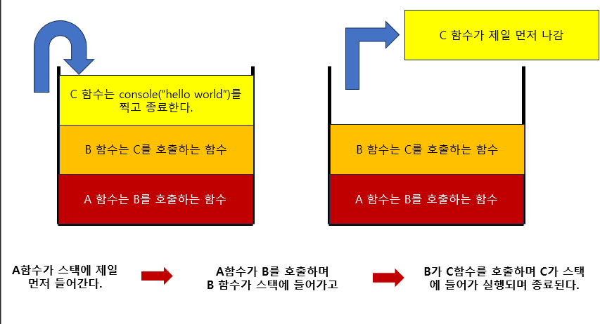
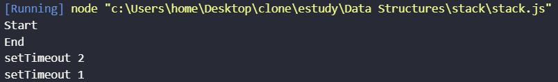

# 스택 (Stack)

- LIFO (Last In First Out) or FILO (First In Last Out)
- 상자에 책 쌓듯이 맨 마지막에 들어간게 가장 첫 번째로 나오는 구조

> 주요 동작

- push(요소) - 스택의 맨 위에 새로운 요소를 추가한다.
- pop - 스택의 맨 위에 요소를 제거하고 반환한다.
- peek or top - 스택의 맨 위에 있는 요소를 제거하지 않고 반환한다.
- isEmpty - 스택이 비어 있는지 확인하고, 비어 있으면 true, 그렇지 않으면 false를 반환한다.
- size - 스택에 있는 요소의 개수를 반환한다.

> 스택의 사용 사례

- **함수 호출 스택 (Call Stack)**

  스택의 대표적인 응용 사례로는 역시 재귀 함수 호출 관리가 있다!
  함수가 호출될 때마다 해당 함수의 정보 (변수, 위치 등)이 스택에 쌓이게 되고, 함수가 종료되면 가장 마지막의 쌓은 함수가 스택에서 제거된다.

  
  그림은 .. 너무 어렵다 예시를 들어보자.

  ```js
  function factorial(n) {
    if (n <= 1) return 1;
    return n * factorial(n - 1);
  }

  console.log(factorial(5)); // 120
  ```

  factorial(5)가 호출 -> factorial(4) 호출 -> factorial(3) -> ...
  이후 각 함수가 반환되면서 스택에서 제거되는 과정이다.

  > **자바스크립트의 이벤트 루프와 콜백 큐 (예외)**

  자바스크립트의 이벤트 루프(Event Loop)에서 콜백 함수들이 실행되는 순서는 기본적으로 FIFO(First In, First Out) 방식인 콜백 큐(Callback Queue)에 의해 관리된다. 하지만 자바스크립트의 스택(Call Stack)에 존재하는 함수들이 모두 실행된 후에야 콜백 함수들이 실행되기 때문에, 스택에서 처리 중인 함수가 우선적으로 실행된다.

  > 뭐라는건지 잘 모르겠으니 직접 해보자.

  ```js
  console.log("Start");

  // 비동기 작업: `setTimeout`
  setTimeout(() => {
    console.log("setTimeout 1");
  }, 1000);

  // 비동기 작업: `setTimeout`
  setTimeout(() => {
    console.log("setTimeout 2");
  }, 700);

  console.log("End");
  ```

  예상은 start -> 1초 후 setTimeout 1 출력 -> 0.7초 후 setTimeOut 2 출력 -> 그리고 End 출력이다. 그런데..

  
  ...? 출력 순서가 이상하다. 이유는 무엇일까?

  자바스크립트 엔진은 메모리 영역에 콜스택이 하나 밖에 없다. (Single Thread)

  setTimeout 함수는 브라우저 API에 의해 비동기로 처리되기 때문에, 콜백 함수는 콜스택에 쌓이지 않고 대기열인 태스크 큐(Task Queue)에 들어간다.

  **콜스택이 비어있을 때만** 태스크 큐에 있는 콜백 함수가 콜스택으로 이동하여 실행된다.

  따라서 위의 코드에서는 Start -> End -> setTimeout 2 -> setTimeout 1 순서로 출력된다.

  무조건 비동기가 먼저 실행되는 것이 아니라, 콜스택이 비어있을 때만 실행된다는 것을 기억하자.

  0초를 줘도 무조건 대기열에 들어가서 콜스택이 비어있을 때 실행된다.

  ```js
  console.log("Start");

  setTimeout(() => {
    console.log("setTimeout 1");
  }, 0);

  // 무한 루프를 통해 콜 스택을 채우기
  while (true) {
    // 아무 작업도 하지 않음
  }

  console.log("End");
  ```

  **위 코드는 무한 루프로 인해 콜스택이 비어있지 않아서 setTimeout 함수가 실행되지 않는다.**
  </br>

  > **백준 10828번 문제로 스택을 직접 구현해보자.**

  ```js
  const fs = require("fs");
  const path = require("path");
  const filePath = path.join(__dirname, "10828.txt");
  const file = process.platform === "linux" ? "/dev/stdin" : filePath;
  let input = fs
    .readFileSync(file)
    .toString()
    .trim()
    .split("\n")
    .map((line) => line.trim());

  let commands = input.slice(1);
  let stack = [];
  let result = [];

  commands.forEach((command) => {
    let [cmd, value] = command.split(" ");
    switch (cmd) {
      case "push":
        stack.push(parseInt(value));
        break;
      case "pop":
        result.push(stack.length ? stack.pop() : -1);
        break;
      case "size":
        result.push(stack.length);
        break;
      case "empty":
        result.push(stack.length ? 0 : 1);
        break;
      case "top":
        result.push(stack.length ? stack[stack.length - 1] : -1);
        break;
    }
  });

  console.log(result.join("\n"));
  ```
